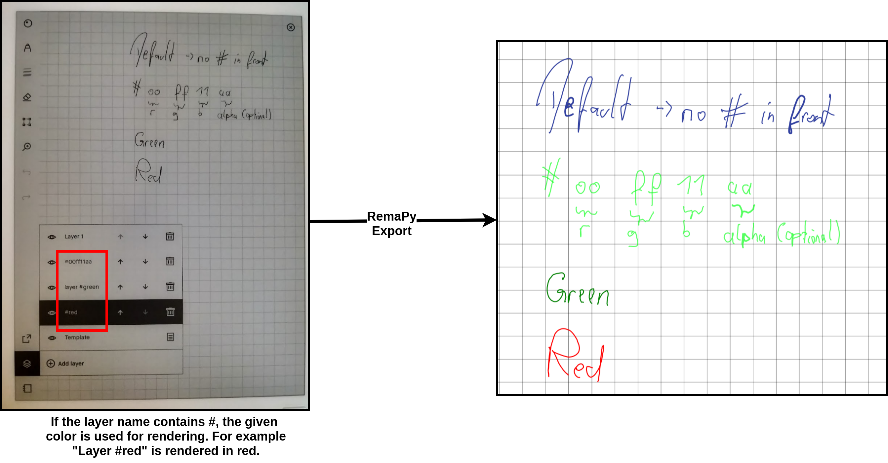

# RemaPy Explorer

RemaPy is an open source file explorer for your reMarkable tablet that uses 
the remarkable cloud. You can upload documents (via copy and paste), open 
notebooks and annotated pdfs and delete documents or collections. RemaPy 
is written in python and only tested on Linux, although it should 
(theoretically) also work on other operating systems such as windows. 
A "how to install", the software architecture and FAQ's 
can be found in the [wiki](https://github.com/peerdavid/remapy/wiki).

*WARNING: This project is not affiliated to, 
nor endorsed by, reMarkable AS. I am not responsible for any 
damage done to your device or your data 
due to the use of this software.*

# Features 
## Overview

## Custom colors
Custom colors for individual layers are used by RemaPy for rendering
if the layer name contains a '#' followed by a valid color name or 
[hex code](https://www.color-hex.com/).
For example "Layer1 #ffee11" is rendered with hex color #ffee11 or "Layer 2 #red" 
is rendered in red. The hex code also supports alpha values (e.g. #ffee11dd).
Therefore you can easily hide layers in the rendering process by setting the last
two values of the hex code to zero: #xxxxxx00.

## Open with or without annotations
With remapy you can open the annotated pdf file (double click). You can also
open the original file without annotations or you can open the file containing
only the pages that are annotated (right click). If evince is installed on your 
system, RemaPy opens the same page as on your tablet. Note that if you open 
a collection, all child items are opened recursively.

## Backup
In the settings tab you can find an option "Backup". This creates a 
backup of all your annotated pdf files into the given folder. Note that it 
it is not possible to backup or restore the *raw* items.

## Upload webpages
If you copy and paste a URL in remapy, the given website is automatically 
converted into a pdf and uploaded to your remarkable. Note that some heuristics
are implemented to accepts the "terms of usage" of pages automatically, 
but this will not work in every case 
(see also [FAQ](https://github.com/peerdavid/remapy/wiki)). Please also note 
that some additional packages must be installed to use this feature 
(pdfkit and wkhtmltopdf).

## Filter
You can use the filter (upper right) to display only a subset of 
documents and collections (not case sensitive). To search only 
for bookmarked items, start your search string with "!b". For example to 
search for all bookmarked items that contain "remapy", enter "!b remapy".
To search all items that contain "remapy" enter only "remapy".

## Other features
 - Upload a pdf or epub via copy and paste
 - Rename or delete items
 - Toggle bookmark
 - Offline mode

# Acknowledgments
[1] Python remarkable api, https://github.com/subutux/rmapy  
[2] Golang remarkable tool, https://github.com/juruen/rmapi/  
[3] Icons made by Freepik, Smashicons, Pixel Perfect, iconixar  srip, 
Good ware, prettycons, Payungkead, dDara from www.flaticon.com  