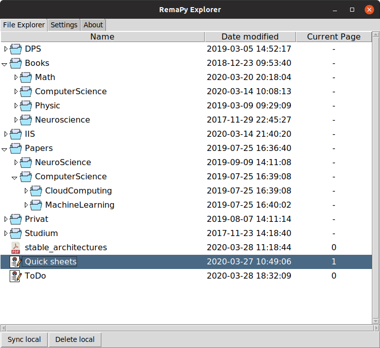

# RemaPy Explorer

RemaPy is an open source file explorer for your reMarkable tablet. You can upload documents via copy and paste from your local file explorer, open notebooks and annotated pdfs and delete documents or collections. RemaPy is written in Python and only tested on Linux,
altough it should (theoretically) also work on other systems. Feel free to 
write an issue if you find a bug or also if you have an idea for new features. 
A list of some todo's and future ideas that I want to implement is given below.

*WARNING:* This project is not affiliated with reMarkable AS, Oslo and you use this tool on your own risk.




# ToDo's
## Basic functionality
 - [x] Authentication
 - [x] Settings page (Path to templates, sync folder, )
 - [x] About page
 - [x] List all folders and files
 - [x] Delete file
 - [x] Open collection (all files of collection with one click)
 - [x] Async backend to keep fronted reactive
 - [x] Check and show if files are our of sync
 - [x] Download file (zip)
 - [x] Download notebook as pdf
 - [x] Download annotated pdf
 - [x] Download epub (without annotations)
 - [x] Download epub (with annotations as pdf)
 - [x] Upload pdf file
 - [x] Upload epub file
 - [x] Show download progress bar
 - [x] Better rendering for highlighter
 - [x] Use multiple threads to download and render documents (speed up)
 - [x] Show sync state also on collection level
 - [x] Show icon while uploading a file
 - [x] Backup annotated files
 - [ ] Alphabetic order of collections and documents in tree
 - [ ] Rename collection
 - [ ] Rename document
 - [ ] Create new collection
 - [ ] Create new notebook
 - [ ] Move collection
 - [ ] Move document
 - [ ] Filter / Search for documents
 - [ ] Better error handling
 - [ ] Logging
 - [ ] Make RemaPy offline ready
 - [ ] Delete local if doc is not available on remarkable 
 - [ ] Set exact versions in requirements.txt

## Future ideas
 - [ ] Zotero sync
 - [ ] SSH access: Update background image, live view
 - [ ] OCR; Search in documents text and handwritten notes
 - [ ] Decrypt encrypted pdf's before uploading it to be compatible with the RM


# How to setup / install RemaPy
For this installation we assume that python3, pip3 and all nvidia drivers
(GPU support) are already installed. Then execute the following
to create a virtual environment and install all necessary packages:

1. Create virtual environment: ```python3 -m venv env```
2. Activate venv: ```source env/bin/activate```
3. Update your pip installation: ```pip3 install --upgrade pip```
4. Install all requirements. Use requirements-gpu if a gpu is available, requirements-cpu otherwise: ```pip3 install -r requirements.txt```


To create a launcher symbol adapt the remapy.desktop file and copy it 
to ~/.local/share/applications/remapy.desktop


# Acknowledgments
[1] Python remarkable api, https://github.com/subutux/rmapy <br />
[2] Golang remarkable tool, https://github.com/juruen/rmapi/ <br />
[3] Icons made by Freepik, Smashicons, Pixel Perfect, iconixar  srip, 
Good ware, prettycons, Payungkead from www.flaticon.com <br />